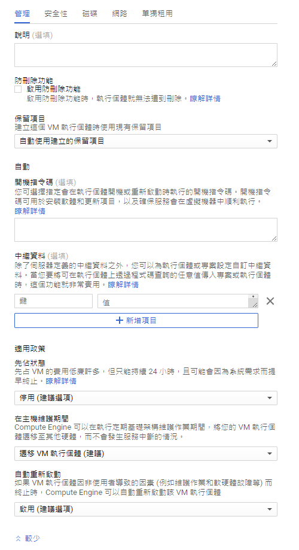
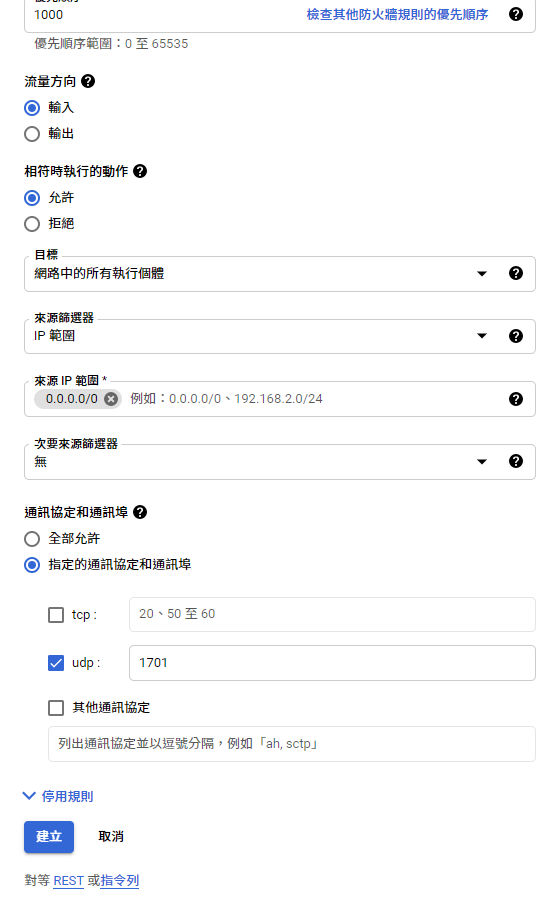

# 在 Google Compute Engine 上建立一個免費的 VM 

Create a free micro VPS on Google Compute Engine

## 前言

為了測試手邊的 LTE CAT-M1 模組，我需要一台有 public IP 的測試主機與之溝通。

大多時候你可以使用 ngrok 這樣的服務來進行這種測試，但 ngrok 目前似乎不支援我需要的 UDP 協定穿透。所以得真的去好好研究一下這種 VM 服務了。

Amazom AWS 和 Google Cloud Platform (GCP) 都有提供這樣的服務，最後選擇 GCP 的原因是在一些條件下能符合免費方案的條件。如果只是為了短期的測試而使用是很方便的。

## 關於 Google Compute Engine

你只要有 gmail 帳號，你就可以用這個帳號進入 [GCP 的主控台](https://console.cloud.google.com/)操作

你可以把 GCP 想像成一個提供各種服務的平台商，你可以在 GCP 上購買各種不同的服務，我們今天要用的 VM 是隸屬於 "[Compute Engine](https://console.cloud.google.com/compute) (GCE)" 的服務。

廢話我就不多說，直接操作吧。

## 建立 VM

### 建立專案

GCP 上面有很多服務/資源可以使用，GCP 的使用邏輯是 -- 你要先建一個專案，然後將你要使用的服務掛在這個專案下面。

假如你是第一次進入這個畫面，注意上方藍色列的 "選取專案" 下拉選單，選單裡面可能是空的。當你點選左邊選單的 "VM 執行個體" (翻譯很爛 = =) 時，右邊內容頁會提示你得先建立一個專案。下面的示範中，我建立了一個名為 "test-VM" 的專案。

然後你需要等個幾分鐘，讓系統啟用 Compute Engine...

有了專案後，你就可以在這個專案中建立一個 VM。按下 "建立"

### 選擇 Region

GCP 在很多國家都有建立機房，理論上我們應該選擇離台灣最近的比較好，但是因為想使用免費方案，而免費的方案中限制只能使用這三個區域的主機:

* us-central1
* us-east1
* us-west1

以下是 GCE 免費方案的條件:

你當然可以去 ping 這三個 region 的主機位址，然後根據 TTL 的時間決定使用哪一個，但如果你不知道主機位置的話，根據地理概念，美西應該會離台灣近一點，所以我這邊將會選擇使用 `us-west1`。

us-west1 還分為 a, b, c 三區，差別是支援不同的 VM，例如 a, b 區可建立支援 GPU 的 VM，c 區就沒有了。但是如果想使用免費方案的話，本來就沒有 GPU 可以用 XD 所以其實沒差。

### VM 基本設定

這邊是主要設定的部分，如果想使用免費方案，你需要注意:

* 區域使用 us-west1
* 機器使用 N1 系列中的 f1-micro 類型
* 開機磁碟使用 30GB 以下

因為我只是要測試，就沒有動磁碟的部份了，維持它是預設的 10GB。但是作業系統可以改，點選 "變更"。

有 ubuntu 18.04 LTS 可以使用。

### VM 其他設定

其他就看你想啟用什麼就打勾。

最底下有五個設定 tabs，以下截圖給大家看。根據需求自訂即可。

#### 管理:

#### 安全性:

#### 磁碟:

#### 網路:

#### 單獨租用:

基本上我幾乎都使用預設的設定。如果沒什麼問題就按 "建立"，然後等待 VM 建立並啟用。

VM 啟用後，你可以看到 GCE 會給你的 VM 配一個 public IP，VM 預設的防火牆規則沒有阻擋 ICMP，所以你可以在 host 主機上使用 ping 測試看看:

## 使用 Cloud Shell

一旦 VM 被建立了，通常我們會希望能透過 shell 操作主機，最簡單的方式就是使用 GCE 頁面所提供的 Cloud Shell。

它是一個將 shell 畫面嵌入網頁的 CLI 介面。點選選單上的圖示啟用即可

你會馬上進入一個以你 gmail 帳號為 username 的家目錄下。

你可以使用 sudo 操作指令，甚至是以 apt 安裝套件。

但要使用 Cloud Shell 必須登入 GCE 頁面後開啟網頁，我覺得有點麻煩。我還是比較習慣使用 host 主機上的 ssh 連線軟體。如果你想要使用 ssh 連線，你首先需要做的事情就是設定金鑰。

## 設定金鑰

你需要在左邊的選單中選擇 "中繼資料"，然後在右邊內容頁中的 "安全殼層金鑰" (什麼翻譯 = =) 中 "新增 SSH 金鑰"。

在你需要連線的主機上以 `ssh-keygen` 產生 key-pair，然後將 `~/.ssh/id_rsa.pub` 的公鑰內容貼在設定欄位中。

如下圖所示。這邊注意一點，你的 pub-key 後面會帶 host 主機的使用者名稱 (ex: andrew)，最終當你連線 GCE 的 VM 時，需要使用這個名稱，而不是 gmail 的 username。這點跟 Cloud Shell 不太一樣。後面的示範會說明。

新增完後的樣子，注意使用者名稱的欄位是 host 主機的 username，而非 gmail 的帳號名稱。

## SSH 連線

真正可以用的 ssh 指令是: `ssh -i </path/to/私鑰> <username>@<VM-public-IP>`

你可以看到以下一些嘗試錯誤時的錯誤訊息:

私鑰的位置在 `~/.ssh/id_rsa`，username 必須是剛剛金鑰設定頁面中所顯示的使用者。以下是連線成功的畫面:

一旦連線成功，你就在 public IP 網段上有一台測試主機可以使用啦!!

## 防火牆開 port

為了系統安全考量，GCE 所提供的 VM 預設會阻擋很多 port。當你的測試需求必須使用特定的 port 時，需要自行設定防火牆規則。

雲服務商通常都會提供簡易的網頁設定介面讓使用者設定。以下示範 "**開啟 VM 上的 UDP 1701 port**" 的步驟。

在 GCP 首頁的左邊選單點選 "VPC 網路" 然後進入 "防火牆" 設定頁面中點選 "建立防火牆規則"

然後就依照下圖的設定，設定輸入方向來自所有 IP -- 0.0.0.0 時

允許 UDP 1701 port 通行。然後點選 "建立"

這樣就完成了!

## Netcat 測試

你可以使用 nc 的指令做測試，在 VM 主機上（左視窗）以 nc 指令開啟一個監聽 UDP 1701 port 的程序。

當 host 端（右視窗）對 VM 的 public ip 送出 UDP 訊息的時候，VM 端就會收到訊息，代表這整段是通的。

當然，如果你在上一個步驟中沒有設定防火牆規則，這邊就會失敗。

## CLI 工具

理論上 GCE VM 給你的 public IP 應該不會是永遠固定的，如果你嫌每次都得要進入 GCP 頁面中才能查到 IP 很麻煩，你可以考慮使用 GCP 提供的 CLI 工具 -- gcloud。

設定及安裝方法請參考官方文件: [Quickstart: Getting started with Cloud SDK](https://cloud.google.com/sdk/docs/quickstart)。原則上只需要安裝一些套件，然後執行 `gcloud init` 選擇專案名稱後就可以使用了。

以下是使用 `gcloud compute instances list` 列出所有 VM 的資訊，該指令的輸出就可以帶出 public IP 資訊了。

## 關於收費問題

啟用 GCP 的時候，Google 會給你一個免費的額度。建議你可以在使用一段時間後進入 "帳單" 的頁面看看這個額度有沒有被扣款。藉此確保你一直都在符合免費的限制下使用 GCE。

~ END ~
